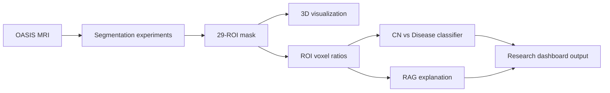

# OASIS Brain Segmentation Project

[](https://www.python.org/)
[](https://github.com/MIC-DKFZ/nnUNet)
[](#project-status)

OASIS 뇌 MRI에서 29개 뇌 구조를 분할하고, ROI별 voxel ratio를 이용한
인지 저하 관련 분류와 결과 설명 흐름을 탐색한 연구 프로젝트입니다.

The repository combines segmentation experiments, an nnU-Net inference and 3D
visualization app, and a retrieval-augmented explanation prototype.

> [!CAUTION]
> 이 프로젝트의 출력은 연구 및 교육 목적입니다. 임상 진단, 예후 판단 또는
> 치료 결정을 대신하지 않습니다.

## Highlights

- U-Net, DeepLab, Light3DHS, and nnU-Net experiment notebooks
- 29-ROI segmentation and relative voxel-ratio analysis
- CN versus `Disease (AD + MCI)` downstream classification prototype
- Gradio and Plotly-based 3D ROI visualization
- Local-document RAG prototype for metric, QC, and ROI explanations

## Project Status

This repository is a research prototype, not a ready-to-deploy clinical product.

| Component | Included | Additional requirement |
| --- | --- | --- |
| Experiment notebooks | Yes | Notebook-specific packages and OASIS/MSD data |
| nnU-Net helper scripts | Yes | Prepared dataset and nnU-Net environment |
| Gradio application | Yes | Trained nnU-Net checkpoint and optional RF model |
| RAG explanation backend | Yes | `OPENAI_API_KEY` |
| MRI data and labels | No | Obtain and prepare them separately |
| Trained model artifacts | No | Supply local `.pth`/`.pt` and `.joblib` files |

## Pipeline



The downstream feature used by the OASIS analysis is:

```text
ROI ratio = ROI voxel count / all non-background segmentation voxels
```

This is a relative ratio, not an absolute volume in `mm³`. See
[Architecture and data flow](docs/ARCHITECTURE.md) for details.

## Repository Layout

```text
.
|-- apps/                              # Gradio inference and visualization app
|-- backend/                           # RAG retrieval and explanation prototype
|-- docs/                              # Architecture and project documentation
|-- notebooks/
|   |-- oasis/                         # OASIS experiments and analysis
|   |-- reference/                     # Decathlon reference experiment
|   `-- colab/                         # Preserved Colab training notes
`-- nnUNet-segmentation-project/       # MSD/nnU-Net helper project
```

## Quick Start

### 1. Clone and create an environment

```bash
git clone https://github.com/Luke-Byun/Oasis-segmentation-project.git
cd Oasis-segmentation-project
python -m venv .venv
```

Activate it on macOS/Linux:

```bash
source .venv/bin/activate
```

Or on Windows PowerShell:

```powershell
.venv\Scripts\Activate.ps1
```

### 2. Choose a component

For the Gradio application:

```bash
pip install -r apps/requirements.txt
python apps/gradio_app.py
```

Copy `.env.example` to `.env` and update the paths before inference. The app
cannot run inference until a compatible nnU-Net checkpoint is available.

For the RAG explanation demo:

```bash
pip install -r backend/requirements.txt
python backend/demo.py
```

Set `OPENAI_API_KEY` in `.env` before running the demo.

For the standalone nnU-Net/MSD helpers:

```bash
pip install -r nnUNet-segmentation-project/requirements.txt
```

Then follow [the helper project guide](nnUNet-segmentation-project/README.md).

## Configuration

| Variable | Purpose | Default |
| --- | --- | --- |
| `nnUNet_raw` | nnU-Net raw dataset directory | Runtime directory |
| `nnUNet_preprocessed` | Preprocessed dataset directory | Runtime directory |
| `nnUNet_results` | Trained nnU-Net results directory | Runtime directory |
| `OASIS_RF_MODEL` | Random Forest artifact path | `artifacts/oasis_rf_model.joblib` |
| `OASIS_RUNTIME_DIR` | Temporary app input/output root | OS temporary directory |
| `OASIS_NNUNET_DATASET_ID` | nnU-Net dataset ID | `1` |
| `OASIS_NNUNET_CONFIGURATION` | nnU-Net configuration | `3d_fullres` |
| `OASIS_NNUNET_FOLD` | Inference fold | `0` |
| `OASIS_NNUNET_CHECKPOINT` | Checkpoint filename | `checkpoint_best.pth` |
| `GRADIO_SHARE` | Enable a public Gradio share URL | `false` |
| `OPENAI_API_KEY` | API key for the RAG demo | None |

## Data and Model Artifacts

Large or sensitive research assets are intentionally excluded from Git:

- OASIS MRI scans and segmentation labels (`.nii`, `.nii.gz`)
- nnU-Net raw, preprocessed, and results directories
- trained checkpoints (`.pt`, `.pth`)
- downstream classifier artifacts (`.joblib`)
- generated predictions and outputs

Do not commit participant data, credentials, or derived files that may contain
sensitive information. The user is responsible for complying with the OASIS
data-use terms and their institution's research-data policies.

## Experiments

| Notebook | Purpose |
| --- | --- |
| [`unet.ipynb`](notebooks/oasis/unet.ipynb) | U-Net segmentation experiment |
| [`deeplab.ipynb`](notebooks/oasis/deeplab.ipynb) | DeepLab segmentation experiment |
| [`light3dhs.ipynb`](notebooks/oasis/light3dhs.ipynb) | Light3DHS experiment |
| [`nnunet.ipynb`](notebooks/oasis/nnunet.ipynb) | nnU-Net-style experiment and evaluation |
| [`segmentation_analysis.ipynb`](notebooks/oasis/segmentation_analysis.ipynb) | Sampling, inference, and ROI extraction |
| [`ml_analysis.ipynb`](notebooks/oasis/ml_analysis.ipynb) | ROI-derived downstream analysis |
| [`decathlon_unet.ipynb`](notebooks/reference/decathlon_unet.ipynb) | MSD/hippocampus reference experiment |

Some notebook cells still contain Google Colab or Google Drive paths. Treat
them as experiment records and adapt the paths before rerunning them.

## Limitations

- The repository does not include the data or trained models needed for end-to-end inference.
- Notebook environments are not fully pinned and may require additional packages.
- The `Disease` class combines AD and MCI; it is not an AD/MCI differential diagnosis model.
- ROI ratios depend on segmentation quality, preprocessing, and dataset distribution.
- Generated explanations can be incomplete or incorrect and require expert review.

## Contributing

Small fixes, documentation improvements, and reproducibility work are welcome.
Read [CONTRIBUTING.md](CONTRIBUTING.md) before opening a pull request.

## License

This repository currently has no license file. Unless the owner adds one,
copyright law applies and reuse permission is not automatically granted.
